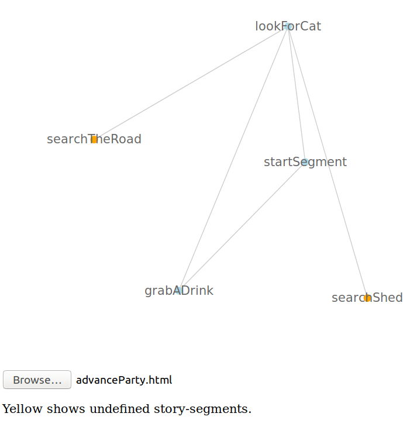

# PicoCYOA

Pico Choose Your Own Adventure is a pico framework for creating interactive fiction written in pure html and Javascript.

Features: 
* Simple to write - use pure html elements
* No compilation - all you need is a text editor
* No bulky framework - only requires a SINGLE js import

## Highlights

Below is the simplest possible story with two possible paths: 

```html                               
  <body>
    <script src="PICOCYOA.js"></script>
      <story-container id="mystory">
        <story-title><h1>Simplest possible story</h1></story-title> <hr/>

        <story-segment id="startSegment" show>
          <segment-content> <p>Choose from options below to progress story:</p> </segment-content>
          <ul>
            <segment-choice target="badEnding"><li>leads to bad ending</li></segment-choice>
            <segment-choice target="goodEnding"><li>leads to good ending</li></segment-choice>
          </ul>
        </story-segment>

        <story-segment id="badEnding">
          <segment-content> <p>Rip GG</p> </segment-content>
        </story-segment>

        <story-segment id="goodEnding">
          <segment-content> <p>nice work</p> </segment-content>
        </story-segment>
      </story-container>
  </body>
```

Stories are defined using custom html elements placed inside the html body tag. Each segment has a unique `id` and story sections are chained together using the `segment-choice` elements.

### Example Stories

A full version of the example that will work in browser is included in the repo: [Simplest Story](SimplestStory.html). 

Also included is the example file [Full Story](Full Story.html) contains a working example including all features.

### Conditional rendering

PicoCYOA affords conditional section rendering of segment choices via utilising pure JavaScript. Using the `condition` property you can show paths only if certain conditions are met, e.g. if the reader has explored certain paths. You can add any JavaScript you wish.

```html
<story-segment id="middleSegment">                                      
          <segment-title>middle Segment</segment-title>                         
          <segment-subtitle>we are in the middle of the story</segment-subtitle>                       
          <segment-content>                                                     
            <p>You can mixin with existing html elements and use javascript to manage state.</p>
            <form action="">                                                    
              <input type="button" value="Click me a few times" onclick="scoreAdder(3);"/>
            </form>                                                             
          </segment-content>                                                    
                                                                                
          <ul>                                                                  
            <segment-choice target="badEnding"><li>leads to bad ending</li></segment-choice>
            <segment-choice target="goodEnding"><li>leads to good ending</li></segment-choice>
            <segment-choice target="excellentEnding" condition="{() => currentScore >= 10 }"><li>leads to best ending</li></segment-choice>
          </ul>                                                                 
</story-segment>                                                        
```
The included script `basicfunctions.js` provides a library of Javascript functions for managing state like scores. Please not that the use of this library is not required for basic choice based navigation.

### Tools for Managing the Story Writing

The included [Grapher](grapher.html) provides the ability to open a story and view the graph of connections between the story segments. This can be useful to visualise the potential paths in the story. Further the graph shows when you have declared a segment but forgotten to write it! Here you can see the result of running on the example story `advanceParty.html` included in the repo:



## Documentation

_full element overview plz_

* logging to help debugging
* JS in conditions
* better css (version without css?, or at least one that allows easier mixin.)
